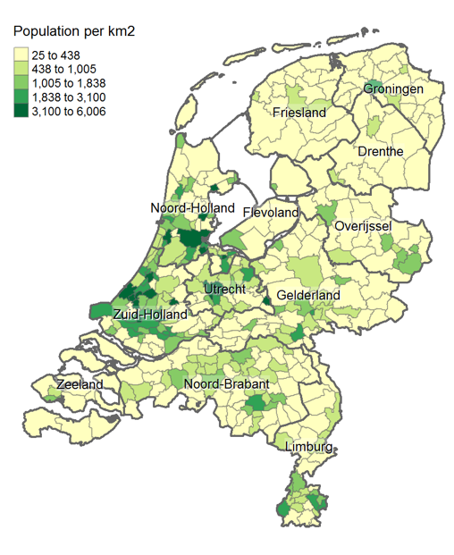
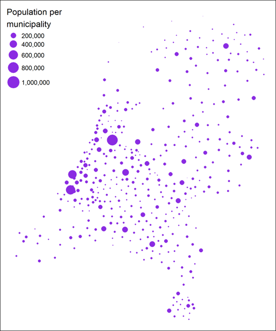

```{r setup, include=FALSE}
knitr::opts_chunk$set(
  echo=FALSE,
  out.width="70%",
  fig.showtext=TRUE,
  fig.align="center"
)
```


## Maps

### Different applications:

- Topography: showing infrastructure
- Satellite: show
- Cartography: display of (statistical) information (Dutch: Bos Atlas!)
- etc.

## Thematic cards

A ** thematic map ** is a visualization in which statistical information (theme) with a geographical component is shown.

- Cartography: communication (_popular! _)
- Analytical purposes: insight, is there a spatial pattern?
- This is typically an application that you will have as a Data Scientist.

### Species

- Choropleet
- Bubble map
- Contour map (isopleet)
- Raster/Density map
- Cartogram

## Choropleth


```{r, out.width="40%"}

```

## Bubble Chart

```{r, out.width="40%"}

```

## Raster data

```{r, out.width="40%"}
knitr::include_graphics("fig/raster.png")
```


## Cartogram

```{r, out.width ="40%"}
knitr::include_graphics("fig/cartogram1.png")
```

## Cartogram

```{r, out.width ="40%"}
knitr::include_graphics("fig/cartogram2.png")
```

## Making maps in R

Different options:

- `tmap`: very extensive options with little code, static + interactive plots
- `ggplot2`:` geom_sf`, static plots
- `mapview`: interactive plots
- `leaflet`: interactive plot

## `ggplot2 :: geom_sf`

```{r, echo=TRUE, eval=FALSE}
library (ggplot2)
ggplot (gm_2017) + geom_sf () + coord_sf ()
```

## 

```{r}
knitr::include_graphics("fig/geom_sf.png")
```

## tmap

```{r, include=FALSE}
library(tmap)
data("NLD_muni")
data("NLD_prov")
sf::st_crs(NLD_muni) = sf::st_crs(28992)
sf::st_crs(NLD_prov) = sf::st_crs(28992)
```

:::::: {.columns}

:::{.column}

```{r choropleth, echo=TRUE, eval=FALSE, warning=FALSE,message=FALSE}
tm_shape(NLD_muni) + 
  tm_fill( "population"
         , convert2density = TRUE
         , style="kmeans") +
  tm_borders(alpha=0.2) +
  
  tm_shape(NLD_prov) + 
  tm_borders(lwd=2, alpha = .4) + 
  
  tm_text("name", size = 0.7)
```
:::

:::{.column}

```{r choropleth, eval=TRUE, out.width="100%"}
```

:::

::::::

## Bubble map

:::::: {.columns}

:::{.column}

```{r bubbles, echo=TRUE, eval=FALSE}
tm_shape(NLD_muni) + 
  tm_fill("lightblue") + 
  tm_borders("white") + 
  tm_bubbles("population"
             , col="green"
             , alpha=0.7
             )
```
:::

:::{.column}

```{r bubbles, eval=TRUE, warning=FALSE, message=FALSE}
```
:::

::::::

## Example 

::::::{.columns}

:::{.column}
\tiny
```{r world, echo=TRUE, eval=FALSE}
data(World)
tm_shape(World) +
  tm_polygons(c("HPI", "gdp_cap_est"),
              palette = list("RdYlGn", "Purples"),
              style = c("pretty", "fixed"), n = 7, 
              breaks = list(NULL, c(0, 500, 2000, 5000, 10000, 25000, 50000, Inf)),
              title = c("Happy Planet Index", "GDP per capita")) +
  tm_style("natural", earth.boundary = c(-180, -87, 180, 87))  +
  tm_format("World", inner.margins = 0.02, frame = FALSE) +
  tm_legend(position = c("left", "bottom"), bg.color = "gray95", frame = TRUE) +
  tm_credits(c("", "Robinson projection"), position = c("RIGHT", "BOTTOM"))
```
:::

:::{.column}
```{r world, eval=TRUE}
```
:::

::::::
